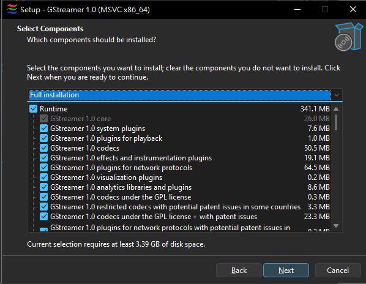
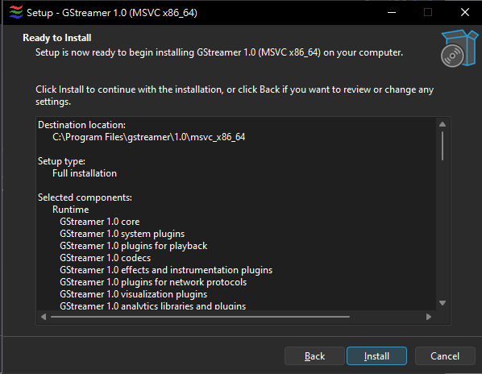

# GStreamer Installation Guide

Shared guide index: [lang.md](../lang.md)

## Overview

GStreamer is the runtime used when running the "Capture Card (GStreamer)" mode in CVM colorBot and is **installed on the CVM machine (Sec PC)**. Installation is **optional**: if you use a capture card as your video source, installing GStreamer can improve capture quality and performance. This guide will help you install GStreamer on Windows.


## Step 1: Download GStreamer Installer

1. Download the GStreamer MSVC installer for Windows x64:
   - **Direct Download from Official Website**: [gstreamer-1.0-msvc-x86_64-1.28.0.exe](https://gstreamer.freedesktop.org/data/pkg/windows/1.28.0/msvc/gstreamer-1.0-msvc-x86_64-1.28.0.exe)
   - **Official Website**: https://gstreamer.freedesktop.org/download/#windows


2. The installer includes both runtime and development packages.

## Step 2: Run the Installer and Select Installation Option

1. Run the downloaded installer (`gstreamer-1.0-msvc-x86_64-1.28.0.exe`).
2. In the installation options, select **"Install for all user"**.
3. Click `Next` to continue.


## Step 3: Welcome Page

1. Read the installer welcome message.
2. Click `Next` to continue.


## Step 4: Accept License Agreement

1. Read the license agreement.
2. Select **"I accept the terms in the License Agreement"**.
3. Click `Next` to continue.


## Step 5: Choose Installation Type

1. Select **"Complete"** installation (recommended) to install all components, including runtime and development packages.
2. Click `Next` to continue.



## Step 6: Select Additional Components (Optional)

1. Select additional components as needed.
2. Click `Next` to continue.


## Step 7: Select Installation Directory

1. Set the installation path to `C:\Program Files\gstreamer\1.0\msvc_x86_64\`.
2. **Do not change the installation directory** - use the path above to ensure proper installation.
3. Click `Next` to continue.


## Step 8: Ready to Install

1. Review the installation settings summary.
2. Click `Install` to begin installation when ready.



## Step 9: Installation Complete

1. Wait for the installation to complete. This may take a few minutes depending on your system.
2. Once installation is complete, click `Finish` to complete the installation.
3. The installer will automatically add GStreamer to your system PATH.


## Step 10: Verify Installation

1. Open a new Command Prompt or PowerShell window.
2. Run the following command to verify GStreamer is installed:

```bash
gst-launch-1.0 --version
```

3. You should see output similar to:

```
gst-launch-1.0 version 1.28.0
GStreamer 1.28.0
```

## Step 11: Using GStreamer in CVM colorBot

1. After installation, restart CVM colorBot if it's running.
2. In the General tab, under Capture Controls, select **"Capture Card (GStreamer)"** from the Method dropdown.
3. Configure your capture card settings (Device Index, Resolution, FPS, etc.).
4. Click `CONNECT` to start using GStreamer capture.

## Troubleshooting

### GStreamer Not Detected

If CVM colorBot cannot detect GStreamer:

1. **Check PATH**: Ensure GStreamer is in your system PATH. The installer should add it automatically, but you may need to restart your computer.
2. **Manual PATH**: If needed, add `C:\Program Files\gstreamer\1.0\msvc_x86_64\bin` to your system PATH manually.
3. **Restart Application**: Close and restart CVM colorBot after installation.

### Installation Issues

- If the installer fails, try running it as Administrator.
- Ensure you have sufficient disk space (GStreamer requires several hundred MB).
- Check Windows Event Viewer for detailed error messages.

### DLL Not Found Errors

- Ensure you downloaded the **MSVC** version (not MinGW) for best compatibility.
- Verify the installation path is correct.
- Try reinstalling if DLL errors persist.

## Additional Resources

- **GStreamer Official Documentation**: https://gstreamer.freedesktop.org/documentation/
- **GStreamer Windows Installation Guide**: https://gstreamer.freedesktop.org/documentation/installing/on-windows.html
