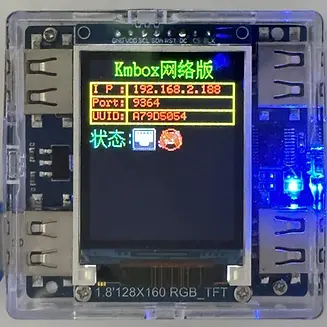
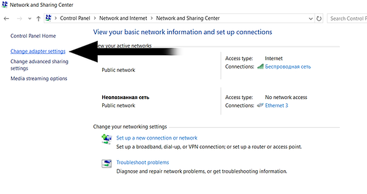
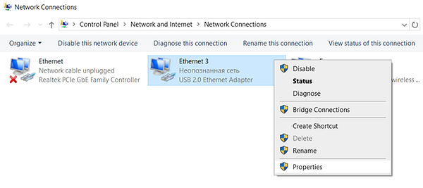
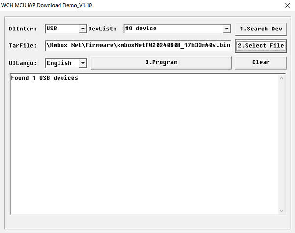
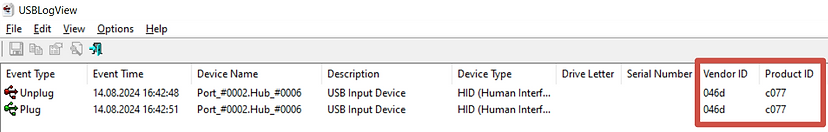

# Kmbox Net Connection Guide

Shared guide index: [README.md](./README.md)

## Objective

Use Kmbox Net network-controlled keyboard and mouse controller in CVM. Kmbox Net is a keyboard and mouse control device that communicates over the network, featuring high speed, strong stability, and high security.

## What is Kmbox Net

Kmbox Net is a network-controlled keyboard and mouse controller with the following features:

- **High Security**: Protocol is not public, each box has independent IP, port, and hardware encoding, uses blocking socket communication, cannot be scanned
- **Strong Stability**: Will not white screen and restart like serial communication
- **High Speed**: 100M dedicated network, communication speed is 100 times that of the original B board, close to 1000 calls per second
- **Automatic Default Human Trajectory**: No keyboard and mouse data anomalies
- **No Mouse Adaptation Required**: Strong universality
- **Supports Monitoring Physical Keyboard and Mouse**: Blocks physical keyboard and mouse functions, convenient for writing software
- **Supports Physical Keyboard and Mouse Learning and Copying**: Supports driver passthrough mode

## Prerequisites

- One Kmbox Net box
- Two blue cables (USB cables)
- Windows 10 or 11 system
- Two computers (single machine mode can connect to the same computer)

## Connection Steps

### 01 Unboxing Introduction

Kmbox Net default includes the following accessories:

- One Kmbox Net box
- Two blue cables

### 02 How to Connect Cables

The back of the box has interface names. Generally connect according to the following diagram:

.png)

- **Game Console Interface (1)**: Connect to target computer (the controlled computer)
- **Network Port (2)**: Connect to control computer (the computer running CVM)

**Note**:
- If it's single machine mode, both network port and game console port connect to the same computer
- If computer B controls computer A, then game console interface (1) connects to computer A, network port (2) connects to computer B

After connection is complete, the Kmbox Net screen should display as shown below:

### 03 Install Network Card Driver (Install driver on computer connected to network port)

1. Connect the network port USB cable to the control computer (second PC)
2. On the second PC, run `2. WCHUSBNIC` driver installer as administrator

3. Select `INSTALL` to install

4. After successful installation, you should see "Driver Install Success!" message

5. **Reboot the second PC**

**Download Network Card Driver**: [Click to download network card driver](https://www.kmbox.top/wiki_doc/kmboxNet/site/)

**Notes**:
- Install the network card driver on whichever computer the network port USB cable is connected to
- Don't install driver on computer A but connect cable to computer B
- If network card driver is installed but no response:
  - Check if network port cable is connected?
  - Confirm driver is installed on the correct computer
  - Confirm running driver installer as administrator

### 04 Modify Network Card IP (Modify network card IP on computer connected to network port)

**Important**: Ensure main PC and second PC are connected to the same local network (e.g., your home Wi-Fi)

#### Open Control Panel → Network and Sharing Center

1. Open Control Panel on the second PC

2. Click "Network and Internet"

3. Click "Network and Sharing Center"

4. Click "Change adapter settings"

#### Modify Network Card IP

1. Find "USB 2.0 Ethernet Adapter" or similar network card device (this is the box's network card)

If you don't see this device, disconnect and reconnect the USB cable from Kmbox to the second PC.

2. Right-click on this network card and select "Properties"

3. Make sure "Internet Protocol Version 6 (TCP/IPv6)" is **disabled**

4. Make sure "Internet Protocol Version 4 (TCP/IPv4)" is **enabled**, click on it and select "Properties"

5. Select "Use the following IP address"
6. Set IP address to: `192.168.2.100`
7. Subnet mask: `255.255.255.0`
8. Leave other fields empty
9. Click "OK" to save

**Important Notes**:
- Modify the box's network card, not your own local network card
- Usually a new network card will appear on the page (the box's network card), modify the box's network card
- If you lose internet after modifying IP, you may have modified the wrong network card
- If the above IP address doesn't work, you can try using: `192.168.2.189`

#### Check Network Connectivity

1. Open Command Prompt (CMD)
2. Execute `ping 192.168.2.1` (the box's default IP)
3. If you can ping successfully, the connection is successful

## CVM Configuration Steps

### First Connection

1. Open CVM's `General` tab
2. Set `Input API` to `NET` or corresponding network mode
3. When starting for the first time, you need to enter Kmbox Net data (IP, Port, UUID)

4. If connection is successful, you should see "Kmbox net connecting is good" message

### Save Configuration

To avoid entering Kmbox Net data every time:

1. Go to config section in CVM
2. Select any config and click save

This way the settings will be saved and will be used automatically on next startup.

## Recommended Starting Values

- `Input API`: `NET`
- `IP Address`: `192.168.2.1`
- `Port`: Set according to actual box port (usually default value)
- `auto_connect_mouse_api`: Set to `false` initially, change to `true` after stable

## Verification Checklist

- CVM can connect to Kmbox Net without timeout errors
- Micro-movement test is smooth, direction is correct
- After restarting CVM, can connect again with the same configuration
- Network ping test is successful

## Troubleshooting

### Cannot Connect

- Check if network port cable is correctly connected
- Confirm network card driver is correctly installed on the computer connected to network port
- Confirm IP address is set correctly (`192.168.2.100`)
- Confirm box's IP address (usually `192.168.2.1`)
- Check if firewall is blocking the connection
- Confirm two computers are on the same network (except single machine mode)

### Network Card Driver Installed But No Response

- Check if network port cable is connected?
- Install network card driver on whichever computer the network port USB cable is connected to
- Don't install driver on computer A but connect cable to computer B

### Why No Internet After Modifying IP

- If you lost internet, you may have modified the wrong network card
- Usually a new network card will appear on the page (the box's network card), modify the box's network card instead of your own local network card
- See the network card modification tutorial above for specific operations

### Mouse Doesn't Work

If the mouse connected through Kmbox doesn't work on the main PC:

- Make sure Kmbox is connected correctly
- Try connecting USB cable to another port on the main PC
- Try using another mouse
- Try connecting mouse to another USB port on Kmbox

### Mouse Sensitivity

Change the sensitivity in the game settings.

### Movement Not Smooth or Delayed

- Check network connection quality
- Confirm using high-quality USB cables
- Avoid using USB Hub, connect directly to computer USB port
- Check if other programs are occupying network resources

### Cheat Doesn't See Kmbox

If the cheat doesn't see Kmbox at startup:

- Make sure your main and second PCs are connected to the same local network (e.g., your home Wi-Fi)
- Try using this IP address in "Internet Protocol Version 4 (TCP/IPv4)" Properties: `192.168.2.189`

### Aimbot Is Not Working

If Kmbox test was successful, but Aimbot doesn't work in the game:

1. Make sure you have started the cheat in mode with Kmbox

Check: `C:\Users\*username*\Documents\directcheats.store`

You will see .cfg files of your games

2. If you are playing Call of Duty, open `MainCOD.cfg` via Notepad

3. Find the line: `"I_DONT_HAVE_KMBOX"`

If you want to play with Kmbox it should be written: `"I_DONT_HAVE_KMBOX" = ": false,`

Save and close the file.

4. After you launched a game and the cheat you need to enable Aimbot and set it up through menu

Make sure you have configured everything correctly.

## Firmware Update

If your Kmbox Net firmware differs from the current one, it's recommended to update (flash) it. This can improve performance, fix bugs, and prevent detection.

**Latest Version**: 20251125 (Last update date: November 25, 2025)

### Update Steps

1. Connect USB cable to your main PC

2. Press and hold this small black button inside the Kmbox using a screwdriver or other thin object

And at the same time connect the USB cable to this connector

The Kmbox screen should turn white, and this blue diode should start flashing rapidly. If this doesn't happen, then try to hold the button again and reconnect the USB cable.

3. On your main PC, go to the folder `DMA Cheats\3. Kmbox\Kmbox Net\Firmware` and install the driver

4. Launch the Upgrade Tool. Click Search Device. In the information line, it should be written "Found 1 USB devices"

5. Click Select file

6. Go to the folder `DMA Cheats\3. Kmbox\Kmbox Net\Firmware`

Change the type of files displayed to `.BIN`

7. Select the firmware file (e.g., `kmboxnetfw20240808.bin`)

8. And click "Program"

9. Wait a few seconds. After the end of the process, you will see a message

**Important**: Firmware update is complete. Now we need to spoof Kmbox according to the guide below. This must be done every time after updating the firmware on Kmbox Net.

## Spoofing Kmbox Net

Spoofing can make Kmbox Net appear as your real mouse, improving security.

### Spoofing Steps

1. Disconnect all cables and mouse from Kmbox

2. Connect your mouse to your main PC as usual, without Kmbox

On your main PC go to `DMA Cheats\3. Kmbox\Kmbox Net\Firmware\Kmbox Net Spoofing\1. For Main PC` folder

And run the `USBLogView.exe`, make the program fullscreen

3. Unplug your mouse from main PC and plug it back in

You will see Vendor ID and Product ID of your mouse

We will need this data later, write it down somewhere in one line without a space

In my case it will look like this: `046dc077`

**Important!** On some mice, for example on my Steelseries Rival 3 Wireless, Vendor ID and Product ID contains only numbers and looks like this: `10381830`. You will fail the spoofing process on such a mouse, I recommend using any other one.

4. Connect Kmbox to your main and second PC

5. On the second PC go to `DMA Cheats\3. Kmbox\Kmbox Net\Firmware\Kmbox Net Spoofing\2. For Second PC` folder

Run `KmboxNet.exe`

Enter IP, Port and UUID from your Kmbox Net

6. Check "Ping" box and click on the big button

7. A window should appear in which OK will be written at the end.

If it doesn't connect to the Kmbox:
- Try to restart it by unplugging it from your main PC and plug it back in
- Run the exe as admin

8. Enter your Vendor ID and Product ID which we saved earlier in one line without a space (in my case it's `10381830`)

And click VID/PID button

9. You should see such a window which means that the process was successful

10. Go back to your main PC and open USBLogView.exe again, make the program fullscreen

11. Unplug the Kmbox from your main PC and plug it back in

You should see the same Vendor ID and Product ID that you saw in Step 3

If it is, then the spoofing was successful

## Advanced Settings

### How to Enable Bypass Mode

Bypass mode allows physical keyboard and mouse to pass directly through the box. For specific settings, please refer to the box manual.

### How to Enable KM Mode

KM mode is one of Kmbox Net's working modes, which can be set in the box's host computer software.

### How to Modify Curves

1. Download the box's host computer control software
2. After connecting the box, you can select hardware curve values and algorithm types
3. Default curve is disabled. If you need to enable it, set it in the host computer software

### Check Box Inherent Parameters

You can view the inherent parameters (IP, Port, UUID) on the box:

## Related Resources

- **Official Documentation**: [Kmbox Net User Manual](https://www.kmbox.top/wiki_doc/kmboxNet/site/)
- **Video Tutorial**: [YouTube Connection Tutorial Video](https://youtu.be/ts4Vc6hs38Q?si=HI33KvlLr6wfqQ-C)
- **Network Card Driver Download**: [Click to download network card driver](https://www.kmbox.top/wiki_doc/kmboxNet/site/)
- **Host Computer Software Download**: [Click to download KmboxNet host computer software](https://www.kmbox.top/wiki_doc/kmboxNet/site/)

## Private Parameters You Need to Add

Please add according to team Notion:

- Kmbox Net firmware version correspondence
- Specific IP address and port configuration
- Recommended setting parameters under different modes
