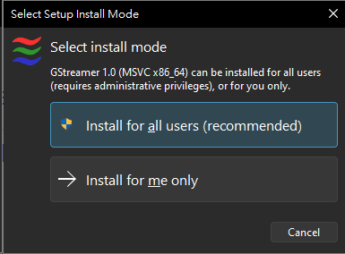
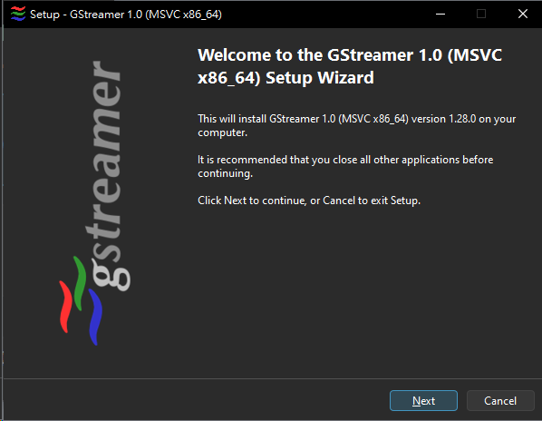
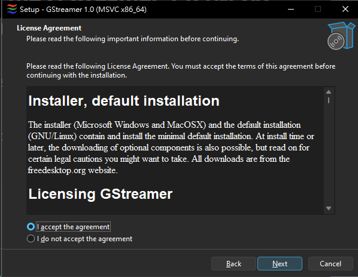
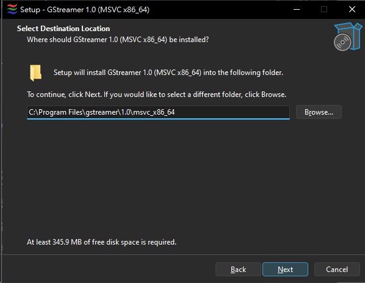
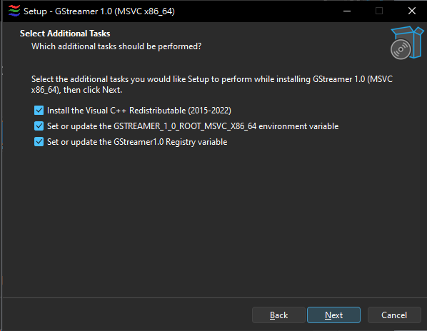

# GStreamer 安裝指南

共享指南索引: [lang.md](../lang.md)

## 概述

GStreamer 是在 CVM colorBot 中使用「Capture Card (GStreamer)」模式所需的運行時。本指南將幫助您在 Windows 上安裝 GStreamer。


## 第 1 步: 下載 GStreamer 安裝程序

1. 下載適用於 Windows x64 的 GStreamer MSVC 安裝程序：
   - **直接下載**: [gstreamer-1.0-msvc-x86_64-1.28.0.exe](https://gstreamer.freedesktop.org/data/pkg/windows/1.28.0/msvc/gstreamer-1.0-msvc-x86_64-1.28.0.exe)
   - **官方網站**: https://gstreamer.freedesktop.org/download/#windows

2. 安裝程序包含運行時和開發包。



## 第 2 步: 運行安裝程序

1. 運行下載的安裝程序 (`gstreamer-1.0-msvc-x86_64-1.28.0.exe`)。
2. 點擊 `Next` 開始安裝嚮導。



## 第 3 步: 選擇安裝類型

1. 選擇 **「Complete」（完整）** 安裝（推薦）以安裝所有組件。
2. 點擊 `Next` 繼續。



## 第 4 步: 選擇安裝目錄

1. 默認安裝路徑為 `C:\gstreamer\1.0\msvc_x86_64\`。
2. 如有需要，可以更改安裝目錄。
3. 點擊 `Install` 開始安裝。



## 第 5 步: 安裝進度

1. 等待安裝完成。
2. 根據系統性能，可能需要幾分鐘。


## 第 6 步: 完成安裝

1. 安裝完成後，點擊 `Finish`。
2. 安裝程序會自動將 GStreamer 添加到系統 PATH。



## 第 7 步: 驗證安裝

1. 打開新的命令提示符或 PowerShell 窗口。
2. 運行以下命令以驗證 GStreamer 是否已安裝：

```bash
gst-launch-1.0 --version
```

2. 您應該看到類似以下的輸出：

```
gst-launch-1.0 version 1.28.0
GStreamer 1.28.0
```


## 第 8 步: 在 CVM colorBot 中使用 GStreamer

1. 安裝完成後，如果 CVM colorBot 正在運行，請重新啟動它。
2. 在 General 標籤頁中，在 Capture Controls 下，從 Method 下拉選單中選擇 **「Capture Card (GStreamer)」**。
3. 配置您的擷取卡設置（Device Index、Resolution、FPS 等）。
4. 點擊 `CONNECT` 開始使用 GStreamer 擷取。


## 故障排除

### GStreamer 無法檢測

如果 CVM colorBot 無法檢測到 GStreamer：

1. **檢查 PATH**: 確保 GStreamer 在您的系統 PATH 中。安裝程序應該會自動添加，但您可能需要重新啟動計算機。
2. **手動添加 PATH**: 如有需要，手動將 `C:\gstreamer\1.0\msvc_x86_64\bin` 添加到系統 PATH。
3. **重啟應用程序**: 安裝後關閉並重新啟動 CVM colorBot。

### 安裝問題

- 如果安裝程序失敗，請嘗試以管理員身份運行。
- 確保您有足夠的磁盤空間（GStreamer 需要幾百 MB）。
- 檢查 Windows 事件查看器以獲取詳細的錯誤訊息。

### DLL 未找到錯誤

- 確保您下載的是 **MSVC** 版本（不是 MinGW）以獲得最佳兼容性。
- 驗證安裝路徑是否正確。
- 如果 DLL 錯誤持續存在，請嘗試重新安裝。

## 其他資源

- **GStreamer 官方文檔**: https://gstreamer.freedesktop.org/documentation/
- **GStreamer Windows 安裝指南**: https://gstreamer.freedesktop.org/documentation/installing/on-windows.html
