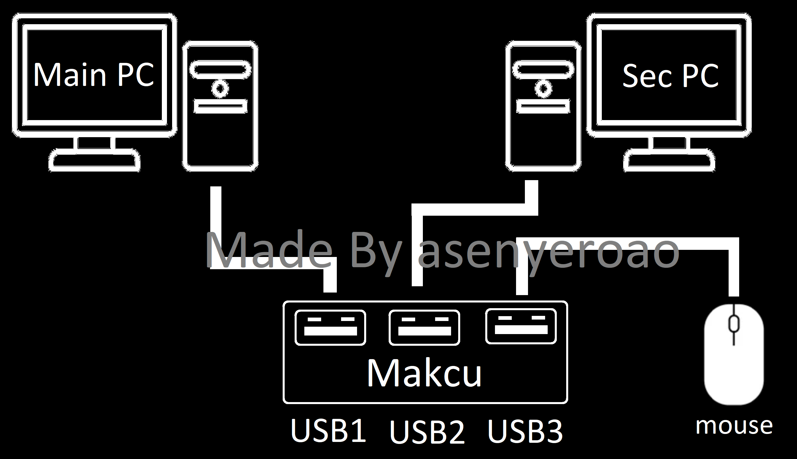

# MAKCU 设置

共享指南索引: [README.md](./README.md)

## 目标

在 CVM 中使用 MAKCU 后端。常规 MAKCU 主要通过 `Input API = Serial` 移动；若为 `3.8 left (firewall)` 固件或未来 `makxdV2` 硬件，推荐使用 `MakV2Binary`（`MakV2` 作为兼容选项）。

## 前置条件

- MAKCU 设备已连接并被 Windows 正确识别。
- 已安装对应 USB/串口驱动。
- CVM 具备访问串口设备权限。

## CVM 配置步骤

1. 打开 `General` 标签页。
2. 常规 MAKCU 先将 `Input API` 设为 `Serial`。
3. 若设备是 `3.8 left (firewall)` 固件或 `makxdV2`，将 `Input API` 设为 `MakV2Binary`。
4. `Port (optional)`（`makv2_port`）建议先自动识别，稳定后固定为具体 COM（如 `COM5`）。
5. `Baud`（`makv2_baud`）设置为固件要求值。
6. 首次手动连接成功后，再开启 `Auto Connect Mouse API On Startup`。

## 建议起始值

- `Input API`: 常规 MAKCU 用 `Serial`；`3.8 left (firewall)` / `makxdV2` 用 `MakV2Binary`
- `makv2_port`: 首次可留空，验证后固定 COM
- `makv2_baud`: `4000000`
- `auto_connect_mouse_api`: 首次 `false`，稳定后改 `true`

## 验证清单

- CVM 可连接 MAKCU 且无超时报错。
- 微动测试平滑，方向正确。
- 重启 CVM 后可用同一配置再次连接。

## 故障排查

- 无法连接:
  - 在设备管理器确认 COM 端口。
  - 关闭占用串口的其他软件。
  - `Serial` 不通时先核对驱动与端口，再按固件类型改试 `MakV2Binary` 或 `MakV2`。
- 移动抖动:
  - 核对波特率与固件是否匹配。
  - 更换高质量 USB 线，避免 USB Hub。
- 每次重启端口变化:
  - 将设备固定在同一 USB 口，并锁定 `makv2_port`。

## 需要你补充的私有参数

请按团队 Notion 补充：

- MAKCU 固件版本对应关系
- 固件要求的 API 模式（`Serial` / `MakV2` / `MakV2Binary`）
- 每个固件线允许的波特率

