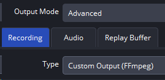
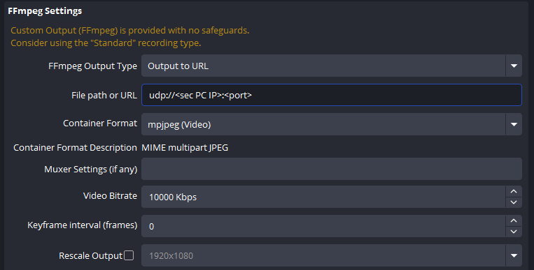
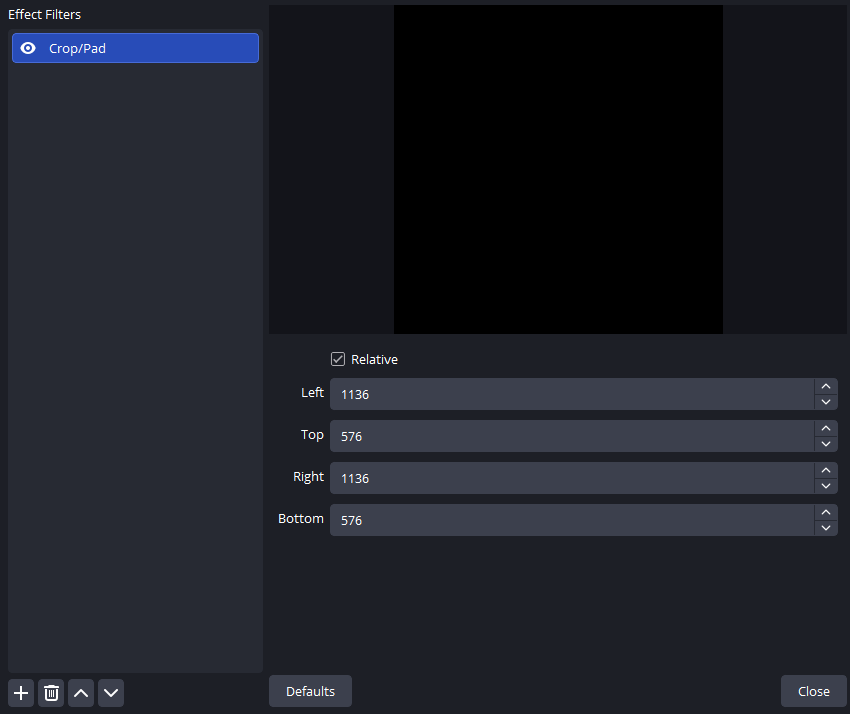
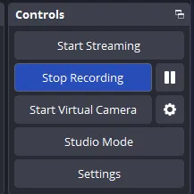

# OBS UDP 设置

共享指南索引: [README.md](./README.md)

按照以下步骤将裁剪后的 FOV 通过 UDP 从主机发送到副机。

## 第 1 步: 配置 FFmpeg URL

路径: `Settings -> Output -> Recording`



配置如下:

1. `Output Mode` 设为 `Advanced`。
2. `Type` 设为 `Custom Output (FFmpeg)`。
3. `FFmpeg Output Type` 设为 `Output to URL`。
4. `File path or URL` 填写:

```text
udp://<sec PC IP>:<port>
```

示例:

```text
udp://192.168.0.1:1234
```

说明:

- `<sec PC IP>` 是副机 IPv4 地址。
- `<port>` 是你选择的未占用端口，推荐使用四位数端口（如 `1234`、`2345`）。

## 第 2 步: 容器与编码设置

建议使用:

1. `Container Format`: `mjpeg (Video)`
2. `Container Format Description`: `MIME multipart JPEG`
3. `Keyframe interval (frames)`: `0`

其它字段可先保持默认。



## 第 3 步: 设置分辨率与 FPS（FOV 尺寸）

路径: `Settings -> Video`


配置如下:

1. `Base (Canvas) Resolution` 设置为你的 FOV 值对应的分辨率。例如，当 FOV 为 `128` 时，设置为 `128x128`。
2. `Output (Scaled) Resolution` 设置为你的 FOV 值对应的分辨率。例如，当 FOV 为 `128` 时，设置为 `128x128`。
3. `FPS` 设置为高于 `144`，建议 `160` / `165` / `180` / `240`（按 GPU 性能选择）。

**重要**: `Base (Canvas) Resolution` 和 `Output (Scaled) Resolution` 都要設置成 FOV 值對應的分辨率（例如 FOV = 128 時，設置為 `128x128`）。

**說明**: 以下表格展示的是 FOV-size 表的格式。在 FOV-size 表中，`Base Resolution` 對應你的桌面/遊戲解析度，`Cropped Resolution` 用於填寫 OBS Filter 的 `Crop/Pad`（見第 4 步）。

示例（FOV = 128，對應 FOV-size 表）:

| FOV | Base Resolution | Cropped Resolution |
| --- | --- | --- |
| 128 | 1920x1080 | 896x476 |

## 第 4 步: 添加 Crop/Pad 滤镜

为确保只传输 FOV 区域，按以下操作:

1. 在 OBS 里选中 `Game Capture` 或 `Display Capture` 源。
2. 点击 `Filters`。
3. 添加 `Crop/Pad`。
4. 按你们的 FOV-size 表填写裁剪值（Left/Top/Right/Bottom）:
   - FOV-size 表中的 `Cropped Resolution` 是用來填寫 OBS Filter 的 `Crop/Pad` 的。
   - `Left` 和 `Right` 对应 FOV-size 表中 `Cropped Resolution` 的第一个值（宽度）。
   - `Top` 和 `Bottom` 对应 FOV-size 表中 `Cropped Resolution` 的第二个值（高度）。

示例（FOV = 128，桌面/遊戲解析度 = 1920x1080）:

根据 FOV-size 表，當桌面/遊戲解析度為 `1920x1080`、FOV 為 `128` 時，`Cropped Resolution` 为 `896x476`。這個 `896x476` 是用來填寫 OBS Filter 的 `Crop/Pad`:
- `Left` = `896`
- `Top` = `476`
- `Right` = `896`
- `Bottom` = `476`

**注意**: 
- 在 FOV-size 表中，根據你的桌面或遊戲解析度（例如 `1920x1080`）找到對應的表格。
- 然後選擇你要的 FOV 值（例如 `128`）。
- 對應的 `Cropped Resolution`（例如 `896x476`）就是用來填寫 OBS Filter 的 `Crop/Pad` 的值。

这样可以避免发送过大帧，降低 UDP 丢帧风险。



## 第 5 步: 开始录制（即开始 UDP 发送）

参数确认后，点击 `Start Recording`。

OBS 会从主机向副机发送 UDP 视频流。



## 副机（Secondary PC）设置

副机里填写的 IP 与端口，必须和 OBS URL 完全一致。

示例:

1. OBS URL:

```text
udp://192.168.0.1:1234
```

2. 副机配置:
- `IP`: `192.168.0.1`
- `Port`: `1234`

只要任一项不一致，副机就无法收到流。

## 如何查看副机 IP 地址

1. 按 `Win + R`，输入 `cmd`，回车。
2. 输入以下命令并回车:

```bash
ipconfig
```

3. 在网卡信息中找到 `IPv4 Address`，该值就是副机 IP。

## 为什么会出现 `frame queue is empty`

常见原因如下:

1. 主机与副机网络不通。
2. OBS 没有点击 `Start Recording`。
3. UI 中 IP 或端口填写错误。
4. OBS 输出、滤镜或编码配置错误。

网络联通性建议双向检查:

```bash
ping <secondary PC IP>
ping <main PC IP>
```

## UDP 用户额外注意

UDP 模式下仍然必须做 `Crop/Pad`。不裁剪会导致帧尺寸过大，网络难以稳定传输，容易出现空队列或丢帧。

## 灰屏并频繁报错: `Corrupt JPEG data: premature end of data segment`

原因: FPS 设置过高，系统解码跟不上。

解决:

1. 降低 OBS FPS。
2. 优先保证稳定，再逐步上调到可承受值。

## FOV Size 对照表

请查看: [FOV-size.md](./FOV-size.md)


