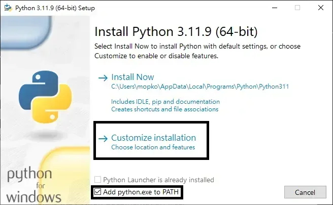
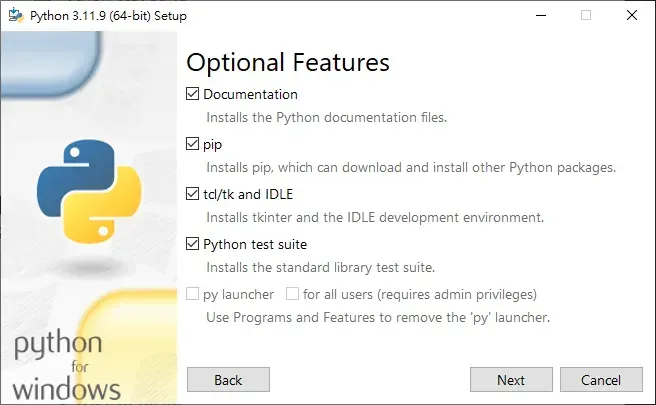
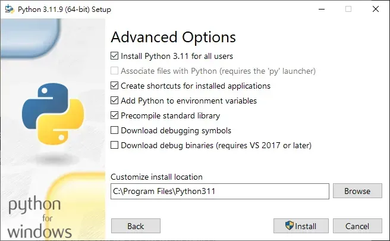

# Python 安装指南

共享指南索引: [lang.md](../lang.md)

## 第 1 步: 下载 Python 安装包

1. 打开 Python 官网下载页。
2. 下载 Python 3（Windows），推荐 `Python 3.11.9`。
3. 运行安装程序。

官网:

- https://www.python.org/downloads/
- https://www.python.org/downloads/release/python-3119/

## 第 2 步: 自定义安装并加入 PATH

1. 在安装界面点击 `Customize installation`。
2. 确认已勾选加入 PATH。
3. 进入下一步。



## 第 3 步: 高级选项并安装

1. 保持 `pip` 启用。
2. 需要时可启用对所有用户安装。
3. 点击 `Install` 开始安装。



## 第 4 步: 完成安装

1. 等待安装完成。
2. 如果出现路径长度修复提示，执行修复。
3. 关闭安装器。



## 第 5 步: 终端验证

执行:

```bash
python --version
pip --version
```

如果两个命令都返回版本号，表示安装完成。
